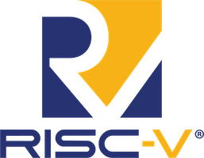

# <p align="center"> RISC-V High-Precision Algorithm Suite</p>

<p align="center">
  
</p>

---

## 📖 Overview

Welcome to the **RISC-V High-Precision Algorithm Suite**. This repository is a curated collection of fundamental computing algorithms—focusing on the duality of **Recursion** and **Iteration**. Designed with a focus on high-precision execution environments, these demonstrations serve as both educational tools and performance benchmarks for RISC-V architecture enthusiasts.

Whether you are exploring the mathematical beauty of the **Tower of Hanoi** or the emergent complexity of **Conway's Game of Life**, this suite provides clean, optimized, and well-documented implementations.

---

## 🛠 Features

### 1. 🔄 Tower of Hanoi (Recursion)
A classic recursive algorithm demonstration.
- **Objective:** Move a stack of disks from one peg to another.
- **Recursion Logic:** Demonstrates how complex tasks can be broken down into identical smaller sub-tasks.
- **Visualization:** Real-time terminal output of each disk movement.

### 2. 🧬 Conway's Game of Life (Iteration)
A cellular automaton that demonstrates how simple iterative rules can lead to complex, lifelike patterns.
- **Objective:** Simulate the birth, survival, and death of cells on a grid.
- **Iteration Logic:** Optimally calculates the next state of the universe based on local neighbor counts.

### 3. ⚡ Iteration Pulse
A lightweight, high-precision demonstration of iterative loops and terminal control sequences.

---

## 🚀 Quick Start

### Prerequisites
- **Bash:** Version 4.0 or later (for the main demo script).
- **Python 3.x:** Required for the high-precision Python implementations.

### Installation
```bash
# Clone the repository
git clone https://github.com/arpittkhandelwal/RISC-V.git

# Navigate to the directory
cd RISC-V

# Grant execution permissions
chmod +x demo.sh
```

### Running the Suite
The `demo.sh` script provides an interactive menu to explore all features:
```bash
./demo.sh
```

---

## 🏗 Project Structure

| File | Description | Language |
| :--- | :--- | :--- |
| `demo.sh` | Main entry point with interactive menu and Bash demos | Bash |
| `hanoi.py` | High-precision recursive implementation of Tower of Hanoi | Python |
| `game_of_life.py` | Optimized iterative implementation of Conway's Game of Life | Python |
| `riscv_branding.png` | Project branding and visuals | Image |

---

## 🌟 Why RISC-V?

**RISC-V** is the future of open-source hardware. By providing clear, documented, and portable algorithm implementations, we aim to:
1. **Simplify Porting:** Make it easier for developers to bring core algorithms to new RISC-V platforms.
2. **Benchmark Performance:** Provide standard tasks for testing instruction execution and recursion depth.
3. **Foster Education:** Encourage a deeper understanding of ISA-level execution through high-level algorithmic demonstrations.

---

<p align="center">
  Built with ❤️ for the RISC-V Community.
</p>
